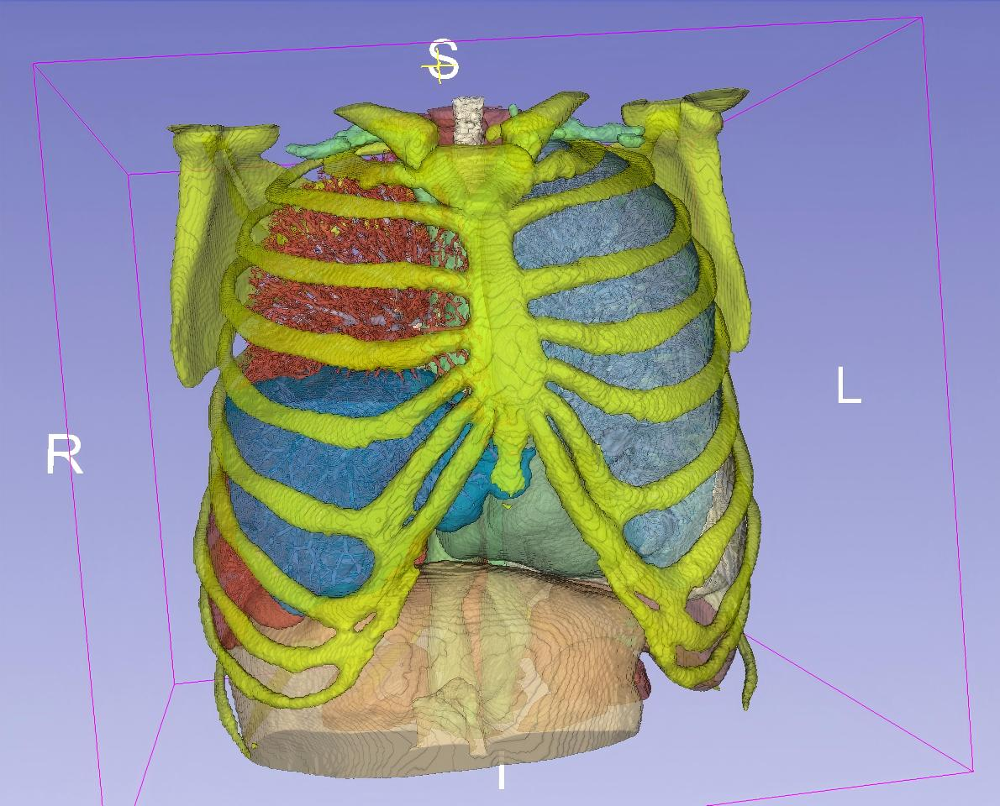
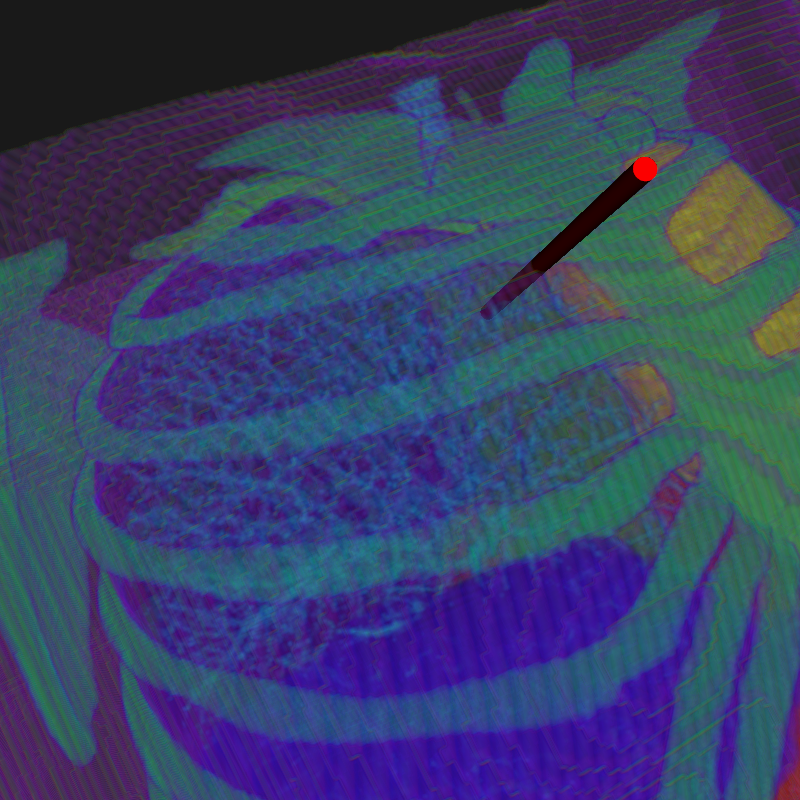

# Illumination-Rigid-Needle-Path  

## Overview  
This project addresses the challenges of rigid needle biopsy.

## Features  
- **Optical Illumination Integration**: Innovative methods to guide needle insertion paths.  
- **Path Planning Optimization**: Improved trajectory planning for rigid needle operations.  
- **Biopsy Application**: Designed specifically to address challenges in needle biopsy procedures.  

## Installation  

TODO

## Example

## Usage  

TODO

## Contributing  
Contributions are welcome! Feel free to submit issues or pull requests to improve this project.  

## License  
This project is licensed under the MIT License. See the [LICENSE](LICENSE) file for details.  

## Acknowledgments  
This project is inspired by the need to advance precision in medical biopsy techniques.  

